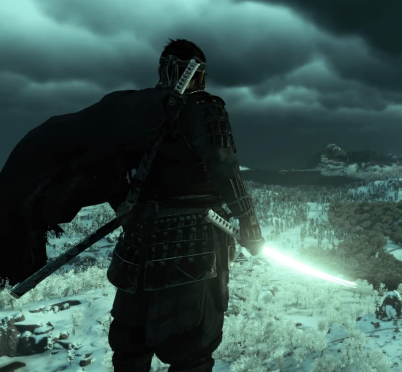

# image processing

## Task 1

 crop and save image: an image is uploaded and its path is set. the user selects two points, marking a rectangular shape that would be cropped, displayed, and saved as a new image

 input image:

output image:

____

draw shapes: an image is uploaded and its path is set. the user selects two points, to draw a rectangle. the same occurs when drawing a circle

drawing rectangle:

drawing circle

## Task 2

extract hsv colors using mouse click: n image is uploaded and its path is set. the point where the user clicks, its color is extracted and this color is used to mask the image showing only the selected color with a lower and upper bound range

